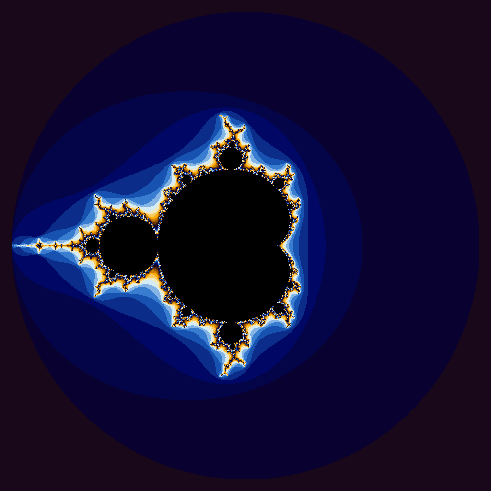

# Project 4: CUDA Acceleration

## Program Descriptions

### 1. Parallelized Iota (`iota.cu`)
The original CPU version used a standard for loop to step through a massive array and fill it with sequential numbers one by one. This is converted into a CUDA kernel whiuch utilizes its ability to work in parallel. The for loops needed to be rewritten to work in parallel, as a for loop is sequential in nature. This is done by utilizing the CUDA variables `blockIdx.x` and `threadIdx.x`. This allows the GPU to work on an array in parallel.

### 2. Fractal Generator (`julia.cu`)
This program translates a traditional CPU application that used nested loops to draw an image pixel-by-pixel into an accelerated GPU program. Instead of processing pixels sequentially, the CUDA version maps the image space onto a 2D grid of thread blocks so that every pixel is evaluated simultaneously. Each thread runs a mathematical loop using complex numbers to determine how quickly a coordinate diverges, mapping that iteration count to a specific color. The final output dynamically handles the math on the graphics hardware to instantly render the detailed fractal image.

---

## Performance & Analysis

### Iota Execution Times

* **CPU Version (Host):** `26.46 seconds`
* **GPU Version (Device):** `33.95 seconds`

### Performance Reflection
**Are the results what you expected? Speculate as to why it looks like CUDA isn’t a great solution for this problem.**

At first thought no, this isnt what I expected, I thoutght that the parallel nature of the GPU would be able to work quicler than a for loop which is forced to work sequentially. After seeing the results and looking more into it, it makes more sense that the GPU would take longer because of the time it takes for the gpu to copy the memory back and forth, the the time it takes the cpu to crank out numbers. It would make sense that the memory bandwith would be a bigger bottleneck than the actual computaion.

---

## Generated Fractal Image

This is the image generated by running `./julia.gpu`:

